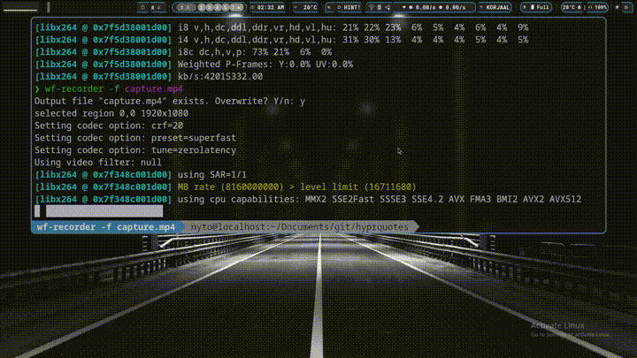

# hyprquotes

A simple, lightweight GTK3 quote overlay for [Hyprland](https://hyprland.org/). It lives silently in `special:scratchpad` and floats into view whenever the active workspace has no open windows — turning your empty desktop into a rotating display of programming wisdom.

---

## Demo



---

## Features

- **Auto-show / auto-hide** — appears on empty workspaces, disappears when you open a window
- **Rotating quotes** — cycles every 10 seconds with a sequential next / previous history
- **Pause & resume** — timer picks up where it left off after a pause
- **Clipboard copy** — one-click copy via `wl-copy`
- **Fully transparent** — composited overlay with no window decorations
- **Bring your own quotes** — plain JSON, easy to extend

---

## Requirements

| Dependency | Notes |
|---|---|
| Python ≥ 3.8 | Standard install on most distros |
| GTK 3 + PyGObject | `python-gobject` / `python3-gi` |
| Cairo + PyCairo | Usually bundled with PyGObject |
| `wl-clipboard` | Provides `wl-copy` for clipboard support |
| Hyprland | Uses `hyprctl` for workspace/window detection |

Install Python dependencies:

```bash
pip install -r requirements.txt
```

Install system dependencies (Arch Linux):

```bash
sudo pacman -S python-gobject python-cairo wl-clipboard
```

Debian / Ubuntu:

```bash
sudo apt install python3-gi python3-gi-cairo gir1.2-gtk-3.0 wl-clipboard
```

---

## Installation

```bash
# 1. Clone the repo
git clone https://github.com/Inknyto/hyprquotes.git
cd hyprquotes

# 2. Run
python hyprquotes.py
```

### Autostart with Hyprland

Add this line to your `hyprland.conf`:

```ini
exec-once = python /path/to/hyprquotes/display_quote.py
```

---

## Quotes format

`assets/programming-quotes.json` is a plain JSON array:

```json
[
  {
    "author": "Linus Torvalds",
    "quote": "Talk is cheap. Show me the code."
  },
  {
    "author": "Alan Kay",
    "quote": "The best way to predict the future is to invent it."
  }
]
```

---

## Controls

| Button | Action |
|---|---|
| ◀ | Previous quote (resets 10 s timer) |
| ⏸ / ▶ | Pause / resume rotation |
| ▶ | Next quote (resets 10 s timer) |
| 📋 | Copy current quote to clipboard |

---

## Contributing

Contributions are welcome! Feel free to open issues or pull requests.

1. Fork the repository
2. Create a feature branch: `git checkout -b feat/your-feature`
3. Commit your changes: `git commit -m "feat: add your feature"`
4. Push and open a PR

Please keep PRs focused and include a short description of what changed and why. If you're adding a new feature, a short demo screenshot or GIF in the PR description is appreciated.

---

Source of some of the quotes: https://gist.github.com/Potherca/5cd28e2a812e5c65c9f7320e0726da18

## License

GPLv2
